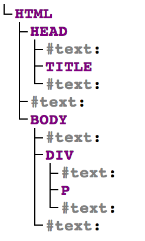
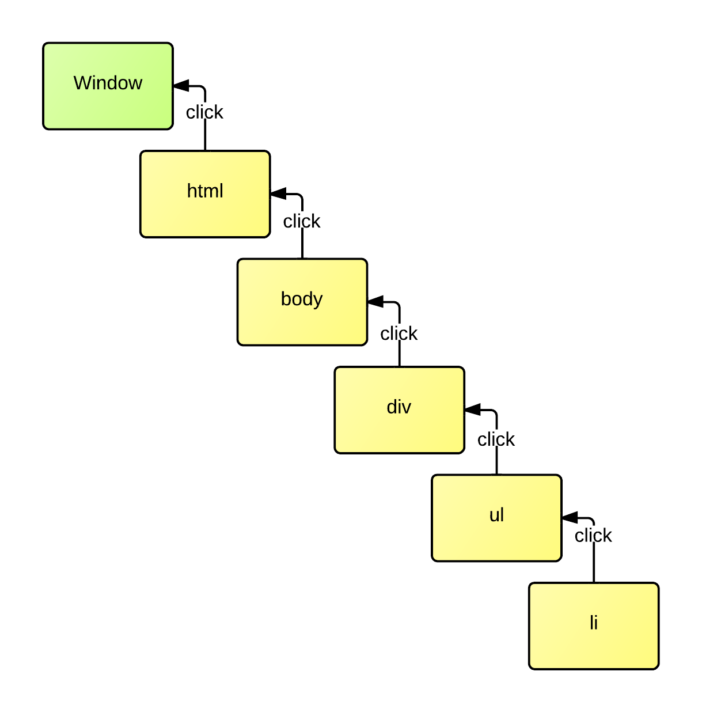

#Indiana Jones and the Temple of DOM

##Summary

Learn how to use the browser's native document object model, or DOM for short, to build a data driven web application.

##Information Box
Knowledge Needed: A basic understanding of JavaScript
Requires: Modern Web Browser (including IE 10 and newer)
Project Time: 1-3 hours

##Author Information
Name: Ryan Anklam


URL: http://blog.bittersweetryan.com


Areas of expertise: JavaScript, CSS

##Link

[http://temple-of-dom]

##Main Text

Ditching the dollar sign can be a scary thought, just like entering the Temple of DOOM.  In the same way Indiana Jones doesn't rely on bombs and machine guns, every web project doesn't need to start with adding third-party libraries. Modern browsers have a powerful API called the Document Object Model, or DOM for short, that developers can leverage to manipulate HTML documents. 

In this article, we'll venture into the Temple of DOM to build an application to search for artifacts (tweets) by Dr. Jones and his crew. Instead of whips and knives, we'll be arming ourselves with methods and properties. Much like Indiana Jones had to deal with Mola Ram in the Temple of DOOM, our villain in the Temple of DOM will be Internet Explorer.  

Let's start with a quick lesson on traversing an HTML landscape so we know how to move around the DOM tree.

###Reading The Map

The terrain we'll face in the Temple of DOM isn't made up of mountains, rivers, and valleys. Our terrain is made up of trees and nodes that relate to each other through parent and child relationships.  

For example the following markup:

    <html>
    <head>
        <title></title>
    </head>
    <body>
        

            

        

    </body>
    </html>

Produces the following DOM tree:

Instead of directions like "left" and "right" we use  directions like "parent" and "child" to move up and down our DOM tree. The DOM has a few properties for node traversal; these properties are available for each node in our node tree. The `childNodes` property is a collection of all an element's child nodes.  

> When a DOM property returns a collection, it is actually an instance of a NodeList object.  The NodeList object is an array-like collection.  It has a length property, and elements can be accessed by index. However, none of the other array methods exist on the collection.  

The `firstChild` property of a node always points to the node's first child. We can also get an element's sibling nodes, or nodes directly above or below it in the tree, by using the `nextSibling` and `previousSibling` properties.  A node's `parentNode` property points to its parent.  The parent of the `html` node is the `document` object itself. 

###The Treasure Hunt

Now that we're prepared to navigate our landscape, let's take a look at where the Temple of DOM will take us.  Our goal will be to search a fake twitter stream for artifacts (tweets) that match a search string and display only the artifacts that contain part or all of our search.  We will also be able to mark artifacts as "favorites" so we can look at them later. Our map for the trip will be quite simple, yet will provide us with the opportunity to use many of the DOM's tools to accomplish our goal:

    

        <section class="search">
            <input type="text" class="search-text" id="search-input">
        </section>
        <section class="tweet-container">
            <ul class="tweets">
                   <!-- this part will be dynamically added to the DOM -->
                <li class="tweet">
                    

                        
                    

                    
                    

                    

                    

                        

                        

                    

                </li>
                   <!-- end dynamic content -->
            </ul>
        </section>
    

   

###First Challenge

As we enter the Temple of DOM, the first challenge we'll face is selecting our input and listening for `keyup` events that will trigger our application to get a list of matching tweets from the server. 

> We use the `keyup` event because the `keydown` and `keypress` events fire continually while the user has a key pressed, however, the keyup event will only fire once per key press.

The DOM provides us with a few different methods used to select elements: `getElementById( id )`, `getElementsByClassName( nam[s] )`, `getElementsbyTagName( name )`, `querySelector( cssSelector[s] )`, and `querySelectorAll( selector[s] )`. While these methods can be useful, the multi-purpose tool we'll use on our journey will be the `querySelector( cssSelector )` and `querySelectorAll( cssSelector )` methods.   `document.querySelector` returns the first matching DOM element it finds and the `querySelectorAll` method returns a collection of all matching elements.

> Note: `getElementsByClassName`, `getElementsByTagName`, `querySelector`, and `querySelectorAll` are also methods that are available on HTMLElement nodes.  This means that they will search the children of a node and return matching results. 

Our map has only a single input, so the `document.querySelector` method is the best fit here.  The following code saves a reference to the search input and saves the result to a variable named `searchInput`:

	var searchInput = document.querySelector( '#search-input' );

Next we need to be able to listen for the `keyup` event to be triggered on the select.  The DOM gives us an easy to use API for subscribing and unsubscribing to events with the `addEventListener( type, listener [,useCapture] )` and `removeEventListener( type, listener [,useCapture] )` methods.  The code below will listen for `keyup` events on the `searchInput` and call the getTweets method.  

    searchInput.addEventListener( 'keyup',  getTweets );

>Versions of Internet Explorer earlier than 9 do not use a standard event model. Instead of using the standard `addEventListener` and `removeEventListener` methods, IE uses `attachEvent` and `detatchEvent`.  The fun doesn't stop there, however, because the event object that gets passed into the callback also deviates from the standards set by the W3C. This means that if you have to support IE 8 and older you cannot rely on the `event.target` and `event.currentTarget` properties existing in the object that gets passed into your callback function.  

###Second Challenge
As we travel deeper into the DOM, we'll need to know how to use the `event` object and how to remove elements from the page. To get data from the server, we'll need to get the text that a user has entered into the input field by using the special `event` object that is passed into our callback.

> The event object has two similar properties that point to DOM objects: `target` and `currentTarget`.  The `target` property refers to the element that the event was dispatched on and the `currentTarget` property refers to the element that the eventListener was attached to.  We'll cover these in more detail in our third challenge. 

`getTweets` will use the `event.target` property to get a reference to the element the user is typing in and will use the elements `value` property to retrieve the text.  Since we won't get much meaningful information out of a single character, the next step is to make sure the user has entered at least two characters before sending data off to the server via AJAX request.  The completed `getTweets` function is shown below:  

    function getTweets( e ){
        var request,
            term;

        term = e.target.value;

        if( term.length > 1 ){
            
            request = new XMLHttpRequest();

            request.addEventListener( 'load', function( e ){
                addTweets( JSON.parse( this.response ) );
            });

            request.open( 'GET', 'http://localhost:3000/search/' + term, true );
            request.send();
        }
    }
    
The `addTweets( data )` function that will be invoked when the ajax request is complete will accept a JSON object as a parameter and clear all the current tweets from the page before adding new ones. 
In order to remove all of the artifacts from the page, we'll need to create a  `clearTweets` method.  Using a `while` loop, we'll loop through all of the ordered lists' children until it has no more, removing each child along the way using the `removeChild( child )` method as shown below:

    function clearTweets(){
        var ele = document.querySelector( '.tweets' );

        while( ele.firstChild ){
            ele.removeChild( ele.firstChild );
        }
    }

###Third Challenge
Our third challenge is going to be long because creating elements using DOM methods can be quite verbose. We could use the `innerHTML` shortcut, however, using it can have some unwanted performance side effects because it has to fire up the browser's HTML parser.  On our journey we'll play it safe and use the more performant methods provided by the DOM.  

Instead of adding the elements directly to the page, we'll use a lightweight container to temporarily build our complete HTML structure prior to inserting them on the page.  The `createDocumentFragment()` returns a container that can hold elements before they are added to the page.  We'll be using the `document.createElement( tagName )` to create new nodes to add to our `documentFragment`. Our new elements will require a bit of styling information, and there are a few different ways of manipulating class information on an element.  The most concise way is to set the element's `className` property.  We could also use the powerful `classList` property. However, since the new elements have no styling information, the `className` property is the easiest way to set the class. (We will come back to the classList property in the next section)

To insert elements, DOM provides us with the `appendChild( child )`, `insertBefore( newEleemnt, referenceElement )`, and `replaceChild( newChild, oldChild )` methods.  `appendChild` method is available on HTMLElement nodes and takes a single HTMLElement node as an argument which will get appended to the node's `childNodes` collection.  The `insertBefore` method is also available on HTMLElementNodes and is a powerful method that gives you a bit more flexibility than `appendChild`.  `insertBefore` takes two arguments, newElement and referenceElement; the newElement will be inserted into the parentNode's children before the referenceElement.  If no referenceElement is passed into `insertBefore`, the newElement is added to the end of the parent's child nodes.  

The last method we'll use when adding artifacts to the page is the `setAttribute( name, value )` method.  This method is used to set attributes on elements, here we will use it to set the `src` property of an `image` tag.

Using these tools we can create the `addTweet` and `createTweet` functions (some redundant code has been removed):

    function addTweet( tweet ){
		...
        tweets.insertBefore( createTweet( tweet ), tweets.firstChild );
    }

    function createTweet( tweet ){
        var fragment = document.createDocumentFragment(),
            li = document.createElement( 'li' ),
            avatarImage = document.createElement( 'img' ),
            tweetContent = document.createElement( 'div'),
            tweetText = document.createTextNode( tweet.tweet );
            
            tweetContent.appendChild( tweetText )

            li.className = 'tweet';
            avatarImage.setAttribute( 'src', 'images/' + tweet.avatar );

            tweetContent.className =  'tweet-content';
			
			//build each li by using appendChild
            fragment.appendChild( li );

            return fragment;
    }

###Fourth Challenge

We're almost out of the Temple safely. However, we'd like to remember some of the things that we saw along the way.  To do this we'll "favorite" the artifacts we really liked by clicking on a star in the UI. The best way to implement this is by using a technique called "event delegation."  Event delegation is a technique where the event listener is placed on a parent element farther up the DOM tree than the intended target. This works because of the way events "bubble up" the DOM tree.

>Event bubbling is where events triggered on child nodes get triggered on parent elements all the way up the DOM tree until the event reaches the top of the tree and is triggered on the global object.  For example if we have an HTML structure that looks like `html > body > div > ul > li` and a user clicks on the li, the click event will fire on the li, ul, div, body, and html elements and each one of these elements can handle the event. 
>

Without event delegation, we'd have to add an event listener on each star on the page.  In addition we'd also have to remember to remove each event listener when items are removed from the page to avoid memory leaks. Also if there is a large list of items with event listeners attached to them, the page could have some performance problems.  
 
In order to implement event delegation into our page, an event listener will be added to the parent element of the artifact list using the same `addEventListener` method as before: 

    var tweetList =  document.querySelector( '.tweets' );
    
    tweetList.addEventListener( 'click', addFavorite );
    
The `addFavorite` method will check to determine if the element that was clicked was a favorite element or not using the `event.target` property and respond accordingly. If the event was triggered by an artifact, we'll modify its class information to signify whether it was favorited or un-favorited. To do this we will use the target's `classList` property.  The `classList` property returns a unique value called a `DOMTokenList`.  `DomTokenList`'s can be iterated like an array, but they also have some useful utility methods.  The `add( class [, additionalClasses] )` method adds a class or multiple classes to an element's classList. It accepts one or more class names as parameters and will append them to the elements `className` attribute.  The `remove( class [,additionalClasses])` method will remove one or more classes from an elements's classList. The `toggle( class )` method will add a class if it does not exist on the element and remove it if the class already exists on the element.  Lastly, the `contains( class )` method will return a boolean value if the element has the class or not. 

> `classList` isn't supported in versions of Internet Explorer earlier than 10.  In order to modify the classes on our elements in IE 9 and older, we'd have to manually manipulate the className string.

In our journey the `toggle` and `contains` methods will allow us to accomplish our goal.  In our event listener, well use the `contains` method to check if the element has a class of "favorite."  If it does we know that the favorite star was clicked and we can then use the `toggle` method to add and remove the `favorite-selected` class with a single line of code.

    function addFavorite( e ){
        
        var target = e.target;
        
        if( target.classList.contains( 'favorite' ) ){
            
            target.classList.toggle( 'favorite-selected' );
        }
    }

###Back to Safety
We made it out of the Temple of DOM alive and were only mildly scathed by a few wretched Internet Explorer quirks.  Throughout this journey we learned about the power of the `querySelector` and `querySelectorAll` methods, how to listen to and remove events from elements, modify an element's attributes, and how to create new elements and insert them into the page.  The DOM API in modern browsers is very powerful and allows you to do many of the things that popular libraries do without having to write a lot of extra code.  

###Resources

Node tree generated with: [http://software.hixie.ch/utilities/js/live-dom-viewer/](http://software.hixie.ch/utilities/js/live-dom-viewer/)

###Callout

###Further Reading
There is much more to the Native DOM that what has been featured in this article.  

  * Mozilla's DOM Reference - [https://developer.mozilla.org/en-US/docs/DOM/DOM_Reference](https://developer.mozilla.org/en-US/docs/DOM/DOM_Reference)
  * Nettuts+ JavaScript and the DOM Series - Lesson One: [JavaScript and the DOM Series](http://net.tutsplus.com/tutorials/javascript-ajax/javascript-and-the-dom-series-lesson-1/), Lesson Two: [http://net.tutsplus.com/tutorials/javascript-ajax/javascript-and-the-dom-lesson-2/](http://net.tutsplus.com/tutorials/javascript-ajax/javascript-and-the-dom-lesson-2/)
  * AppendTo's DOM Manipulation 101 Videos - [http://learn.appendto.com/lesson/dom-manipulation-101](http://learn.appendto.com/lesson/dom-manipulation-101)

